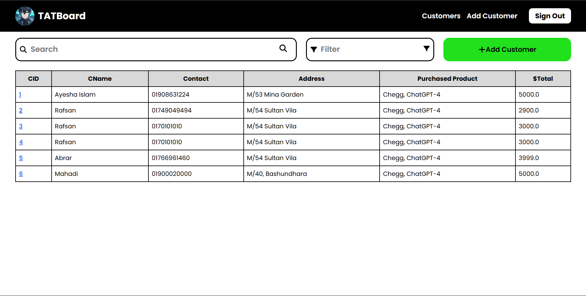

# 

Tatboard is a lightweight web application designed as a digital ledger to manage customer information. Built using Flask and SQLite, it allows users to efficiently store and manage customer details. The application includes a secure login/logout functionality, where only the main user has access to the system, providing an organized way to track and manage customer records.

## Features

### General Features:

- **Secure Login/Logout:** Only the main user can log in and access the dashboard.
- **Customer Management:** Store and manage customer details including name, email, phone number, address, and amount.
- **Data Storage:** All data is stored in a secure SQLite database.
- **Profile Picture:** Users can upload and set a profile picture.

### User Authentication:

- **Password Protection:** Passwords are securely hashed using `werkzeug.security`.
- **Role-based Access:** The system ensures that only the main user has access to all features.

### Customer Management:

- **Add Customer:** Add customer details including name, email, phone, address, and amount.
- **View Customers:** View the list of all stored customers.

## Tech Stack


## Getting Started

### Prerequisites

1. **Python 3.x** installed on your machine.
2. **Flask** and required dependencies.

### Installation

1. Clone the repository:
   ```bash
   git clone https://github.com/your-username/tatboard.git
   cd tatboard
   ```
